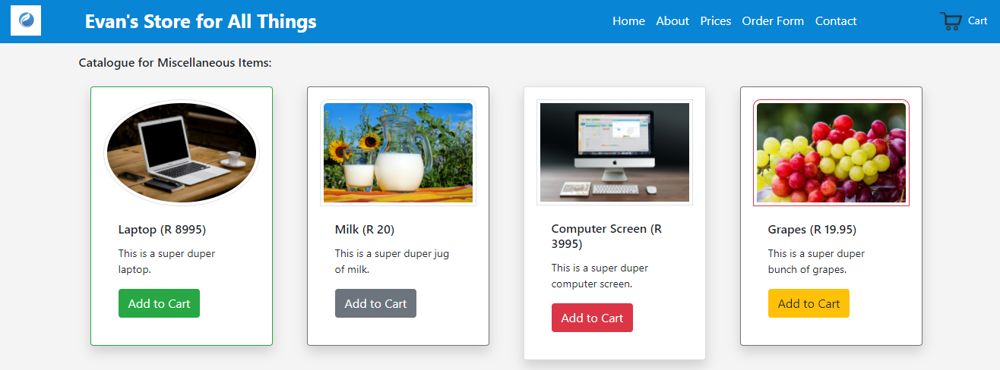

# HyperionDev Full Stack Web Development Bootcamp - Level 1 - Task 6 - Bootstrap

## Description
This task was my introduction to using Bootstrap. It is a single page website and the links are not active. It's simply a demonstration of the attractive styles created with Bootstrap.

## Table of Contents
* [Instructions](#instructions)
* [Technologies](#technologies)
* [Installation](#installation)
* [Usage](#usage)
* [Credits](#credits) 

## Instructions
These were the instructions I was given to guide me in this task:

**Follow these steps:**
* Create a catalogue page for an online store. The catalogue page lists the items which are for sale.
    * Your catalogue page should have at least 10 items for sale. Include an image and a brief description of each item.
    * Your page should include a form (don’t worry about functionality at this stage).
    * Style this page using Bootstrap. Copy and paste the link to the Bootstrap stylesheet into the head of your HTML pages. The link can be found here. Choose a Bootstrap version at your discretion (currently on version 4). You should be able to select the version of Bootstrap
from the top right-hand corner of the Bootstrap page. Note: Be creative. You can style your page however you like as long as all the requirements below are implemented with the use of the Bootstrap framework.
* Use a grid.
* Change your images to thumbnails. Add a comment that explains what a thumbnail is according to Bootstrap.
* Format your images to have a responsive image attribute. Add a comment that explains what a responsive image is.
* Create a table for your web page and format it as a hover table.
* Migrate your form to a horizontal form.
* Customise any implemented buttons.
* Customise multiple image/thumbnail shapes.
* Change all borders to have rounded edges and implement shadows for the boxes. If using Bootstrap version 3, you can use CSS to implement this task requirement.

### Technologies
This project uses:
* HTML 5 
* CSS 3
* Javascript ECMAScript 2021
* Bootstrap 4

## Installation
This project requires no special installation, as it is simply a webpage. Open the index.html file in your web browser.

## Usage 
This is a single page website, so the links on the page will not work. It is merely a demonstration of the attractive styling that is possible with Bootstrap. See figure 1 below.

## Credits
This project was created by Evan Malherbe as part of a task for HyperioDev Full Stack Development Bootcamp November 2021 [GitHub profile](https://github.com/evanmalherbe) 